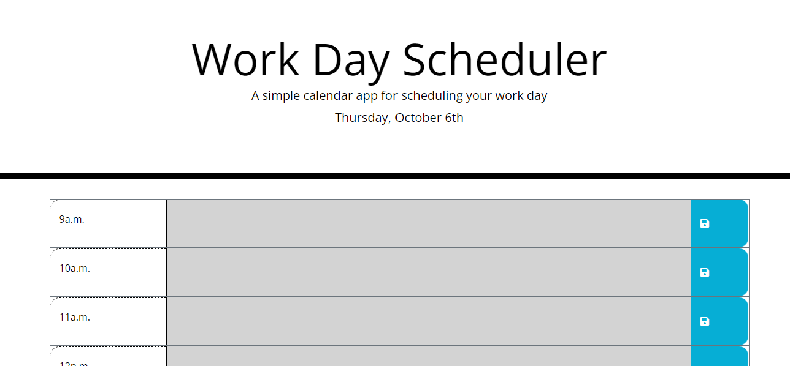
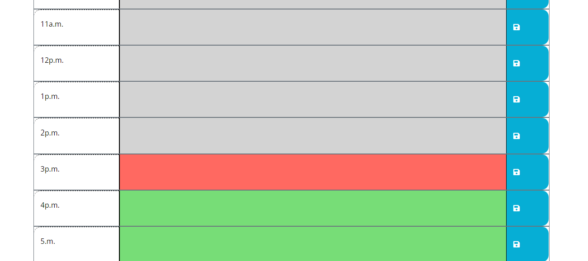

# work-day-scheduler
Description:

This repo contains a workday scheduler. The user can input their day's tasks and save them to local storage so that the tasks remain upon refreshing or re-accessing the page.

The repo also includes color coded sections to indicate past, present or future tasks that will change in real time.

Installation: N/A

Usage: N/A

Credits: Nathan Alexander

License: Please refer to the license in the repo

Badges: N/A

Features: Realtime color-coded tasks to indicate past, present and future tasks. Local storage to save tasks upon refresh.

How to Contribute: N/A

Tests: N/A

Screenshot:

